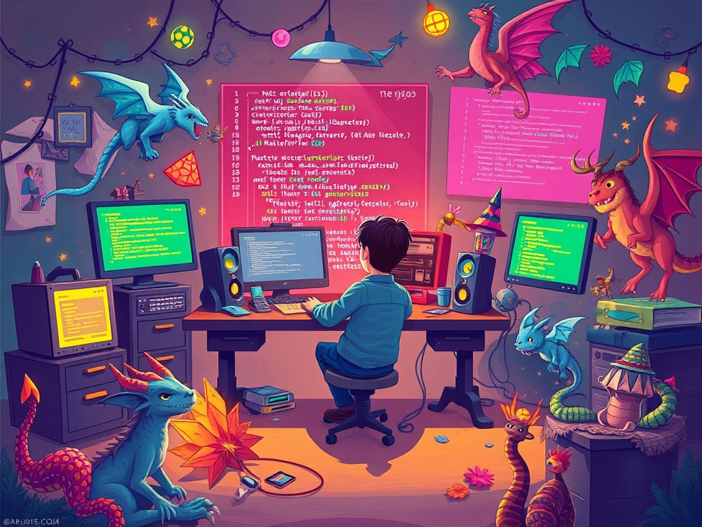

# Once Upon a Time...

## Story

Once upon a time, there was a developer named Alex. Alex was passionate about coding and spent long nights crafting beautiful applications. One day, while exploring the depths of the internet, Alex stumbled upon an ancient code library that promised to unlock new abilities for any programmer brave enough to use it.

Curious and eager to enhance their skills, Alex decided to dive deep into the library. With each line of code, they discovered new techniques and algorithms that could solve problems in ways they had never imagined. However, as Alex delved further, they realized that the library was guarded by a series of challenges that tested not only their coding skills but also their creativity and perseverance.

Determined to conquer these challenges, Alex embarked on a journey filled with debugging dragons, algorithmic puzzles, and a community of fellow developers who were also seeking to harness the power of the library. Together, they formed a guild, sharing knowledge and encouragement, and soon, word of their quest spread across the coding community.

As the guild faced each obstacle, they learned valuable lessons about collaboration, innovation, and the true spirit of development. They discovered that the real treasure was not just the skills they acquired, but the friendships they forged along the way.

With newfound confidence and mastery over the ancient library, Alex and the guild decided to share their knowledge with the world. They created open-source projects, wrote tutorials, and held workshops, inspiring others to embark on their own coding journeys.

And so, the story of Alex and the guild of developers continues, as they strive to make the digital world a better place, one line of code at a time.

## Contributing

Feel free to contribute your own chapters to the story! Whether it's a new character, a twist in the plot, or a lesson learned, your ideas are welcome.

## License

This story is open for everyone to enjoy and expand upon. Share your creativity!
